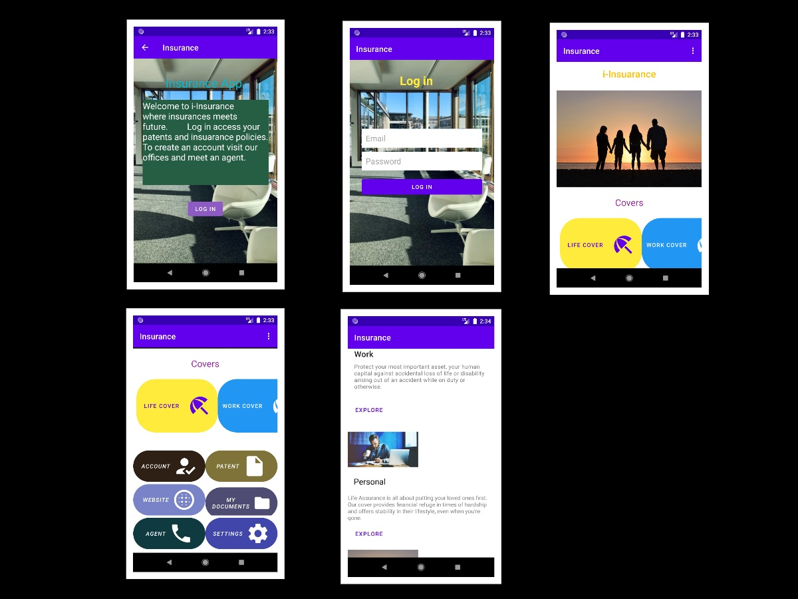

# I INSUARANCE

### VICTOR KURIA

## -- Description --
The main goal of the app is to bring the insurance company straight to the pocket of an individual. The app will allow a user to access
their account from their mobile phone and be able to view their current insurance documents or even apply for others.
The Application will make it easier to breach the gap between the two parties and eradicated paper records.

## Setup/Installation and Usage
- Clone this repository and open with Android Studio
- https://github.com/EKibet/i-insurance-android
- Emulate on a virtual Machine or on your Phone Device

## BDD
## Behaviour
Account creation and Login authentication well implemented
User is able to log in to the application.
User is able to navigate through sections of different sections
User is able to reach out to an agent.
User is able to see patents offered.
User is able to visit official website.

## TECHNNOLOGIES USED
- Java
- Android Studio
- Xml
- Roboelectric
- Espresso
- Postman - For testing the responses from the endpint params.

## Quick Demo of the App
What you get after starting the app     

## Future Implementation.
Enable user to view and save their documents.
Enable user to share their documents.
Enable user to register through the account.

## LICENSE

Copyright 2020 Victor Kuria
Permission is hereby granted, free of charge, to any person obtaining a copy of this software and associated documentation files (the "Software"),
to deal in the Software without restriction, including without limitation the rights to use, copy, modify, merge, publish, distribute, sublicense,
 and/or sell copies of the Software, and to permit persons to whom the Software is furnished to do so, subject to the following conditions:
The above copyright notice and this permission notice shall be included in all copies or substantial portions of the Software.

THE SOFTWARE IS PROVIDED "AS IS", WITHOUT WARRANTY OF ANY KIND, EXPRESS OR IMPLIED, INCLUDING BUT NOT LIMITED TO THE WARRANTIES OF MERCHANTABILITY,
FITNESS FOR A PARTICULAR PURPOSE AND NONINFRINGEMENT. IN NO EVENT SHALL THE AUTHORS OR COPYRIGHT HOLDERS BE LIABLE FOR ANY CLAIM, DAMAGES OR OTHER LIABILITY,
WHETHER IN AN ACTION OF CONTRACT, TORT OR OTHERWISE, ARISING FROM, OUT OF OR IN CONNECTION WITH THE SOFTWARE OR THE USE OR OTHER DEALINGS IN THE SOFTWARE.